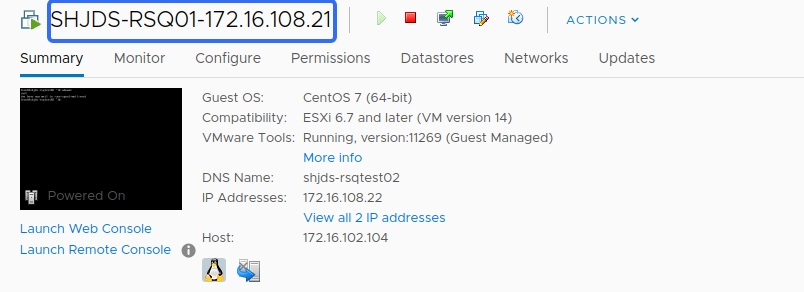
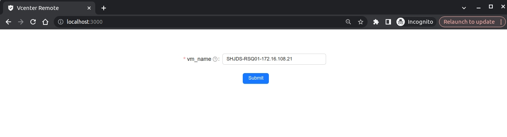
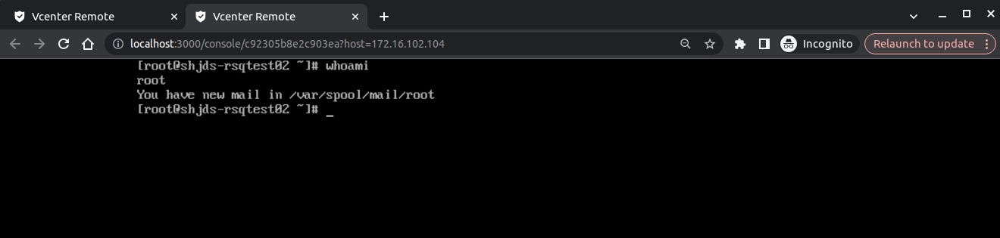

# React-Vcenter

基于go & react实现远程vSphere vcenter虚拟机的功能，提供与vcenter管理中的`Launch Web Console`相同的功能。

## Demo

URL: `http://localhost:3000`








## Quick Start

1. 配置前端访问后端的代理

`frontend/package.json`

```
  "proxy": "http://localhost:8888" // The backend addr
```

`frontend/src/setupProxy.ts`
```typescript
export const { createProxyMiddleware } = require('http-proxy-middleware')

module.exports= function (app:any) {
    app.use(
        createProxyMiddleware(
            "/api",
            {
                target: "http://localhost:8888", // The backend addr
                changeOrigin: true,
                ws: true,
                pathRewrite:{
                    "^/api":"",
                },
            }
        )
    )
}
```

2. 配置websocket地址

`frontend/src/components/Console/index.tsx`, `domain_name` requires a value for nginx server_name
```typescript
const consoleUrl = 'wss://<domain_name>/ticket/' + ticket + '?ip=' + host
```

3. 配置vCenter宿主机的nginx代理，所有访问虚拟机console页面的请求均由nginx来代理转发到指定的vCenter宿主机上

```nginx configuration
server {
    listen 80;
    server_name vc.rsq.cn;
    return 301 https://$http_host$request_uri;
}

server {
    listen 443 ssl http2;
    server_name          vc.rsq.cn;
    ssl_certificate      nginx_conf/certs/rsq.cn.pem;
    ssl_certificate_key  nginx_conf/certs/rsq.cn.key;
    ssl_session_timeout 1d;
    ssl_session_cache shared:MozSSL:10m;
    ssl_ciphers ECDHE-ECDSA-AES128-GCM-SHA256:ECDHE-RSA-AES128-GCM-SHA256:ECDHE-ECDSA-AES256-GCM-SHA384:ECDHE-RSA-AES256-GCM-SHA384:ECDHE-ECDSA-CHACHA20-POLY1305:ECDHE-RSA-CHACHA20-POLY1305:DHE-RSA-AES128-GCM-SHA256:DHE-RSA-AES256-GCM-SHA384;
    ssl_prefer_server_ciphers off;
    ssl_protocols TLSv1.1 TLSv1.2;

    add_header 'Access-Control-Allow-Origin' '*';
    add_header 'Access-Control-Allow-Credentials' 'true';
    add_header 'Access-Control-Allow-Methods' '*';
    add_header 'Access-Control-Allow-Headers' '*';

    access_log  /var/log/openresty/vc.access.log main;
    error_log   /var/log/openresty/vc.error.log warn;

    location / {
        proxy_pass https://$arg_ip;
        proxy_http_version                 1.1;
        proxy_cache_bypass                 $http_upgrade;

        # Proxy headers
        proxy_set_header Upgrade           $http_upgrade;
        proxy_set_header Connection        $connection_upgrade;
        proxy_set_header Host              $host;
        proxy_set_header X-Real-IP         $remote_addr;
        proxy_set_header Forwarded         $proxy_add_forwarded;
        proxy_set_header X-Forwarded-For   $proxy_add_x_forwarded_for;
        proxy_set_header X-Forwarded-Proto $scheme;
        proxy_set_header X-Forwarded-Host  $host;
        proxy_set_header X-Forwarded-Port  $server_port;

        # Proxy timeouts
        proxy_connect_timeout              60s;
        proxy_send_timeout                 120s;
        proxy_read_timeout                 120s;
    }
}
```

4. 配置vCenter sdk的账号密码和URL地址信息

`backend/pkg/client.go`

```go
vcenterURL   = flag.String("vcurl", "https://<user>:<pass>@vcenter.rsq.cn/sdk", "URL of vCenter Server instance")
```

5. 开启前后端服务
```bash
# start frontend
cd frontend
npm i
npm run start

# start backend
cd backend
go mod tidy
go run main.go
```